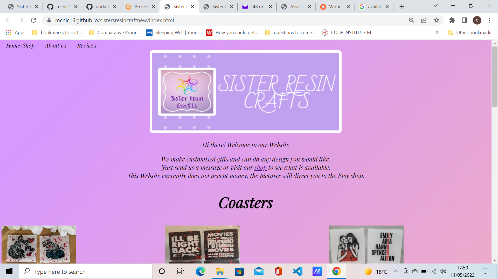
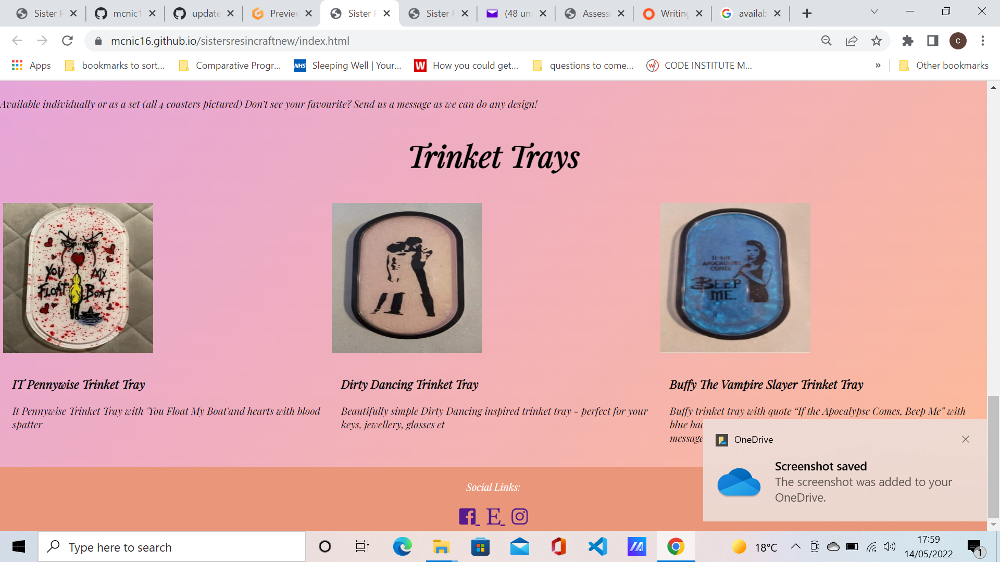
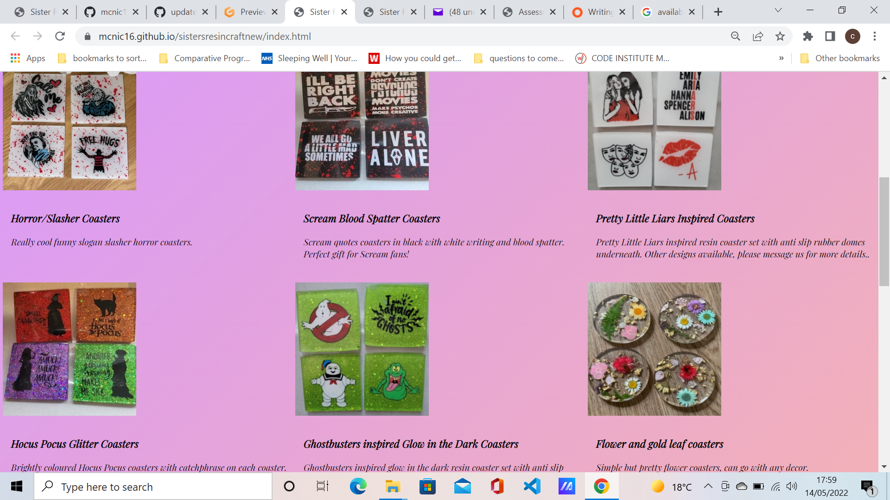
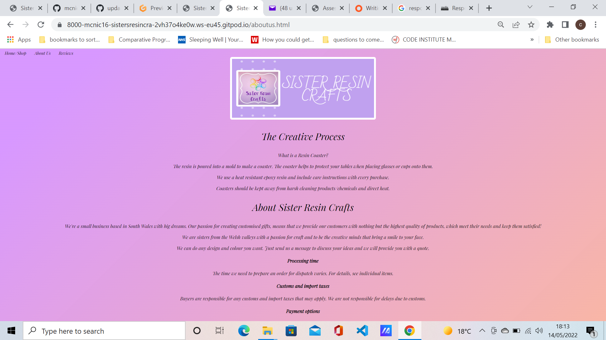
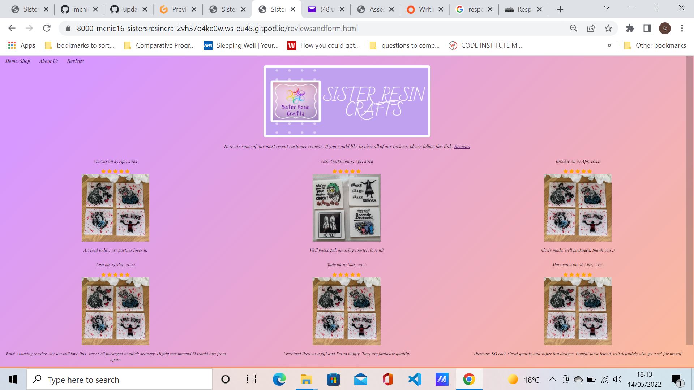

<h1 align="center">Sister Resin Craft</h1>

[View live project](https://mcnic16.github.io/sistersresincraftnew/index.html)

This is the Website for Sister Resin Crafts. It is designed to be responsive and accessible on a range of devices, making it easy to navigate for potential customers with potential developments to be added in the future.
Currently all items on the site are linked to an Etsy shop. Items cannot be purchased through the website but this development will be added at a later date.
The Home page is also the page for the shop, with items that currently available for purchase. The about page is a bit about how the items are made and a bit about Sister Resin Craft and the third page is a customer review page. I had wanted to add a form to the page, but I did have some technical problems with it, and due to time issues aswell I have decide to add it at a later date.

<h2 align="center"></h2>

<h2 align="center"></h2>
<h2 align="center"></h2>
<h2 align="center"></h2>

## User Experience
 ### User stories
As I first time visitor I would like: 
1. To learn the background of the company.
2. For the site to be user friendly and easy to navigate.
3. Reviews and ratings from other customers to be easy to locate.
4. Learn any further information through the company's social media platforms.

As a returning customer I would like:

1. To see the website has been updated and what new items are available.
2. To easily find any promotional offers available including sales.
3. To be able to contact company directly with any queries or customer orders.

 ## Design
- The main colour scheme of the website is purple ombre, black and white.

## Typography
- The main font for the website is Playfair Display.

## Technologies Used
Languages:
- HTML 5 and CSS

## Frameworks, Libraries & Programs Used

- [Font Awesome](https://fonts.google.com/)
 Font Awesome was used on all pages throughout the website 
 - [Git](https://git-scm.com/)
Git was used for the Gitpod terminal to commit to Git and Push to GitHub.
 
 - [GitHub:](https://github.com/)
 GitHub is used to store the projects code after being pushed from Git.

 ## Testing

-  The W3C Markup Validator and W3C CSS Validator Services were used to validate every page of the project to ensure there were no syntax errors in the project.

-   [W3C Markup Validator](https://jigsaw.w3.org/css-validator/#validate_by_input)

